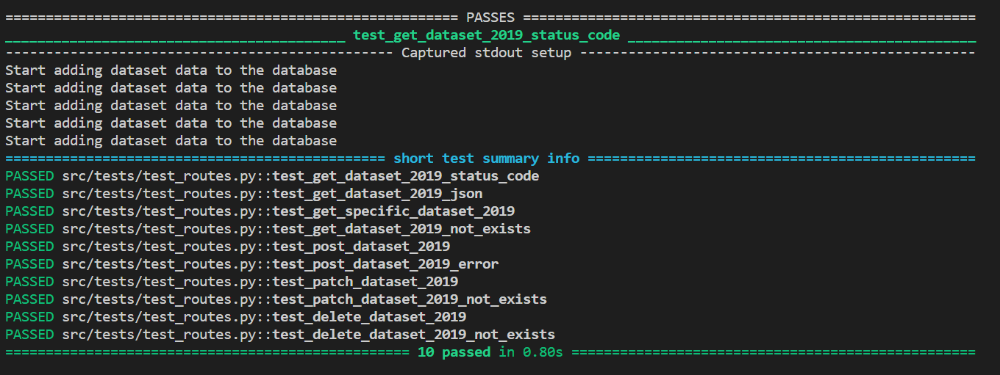

# Testing
All tests for the REST API used pytest and flask test client. 

## Test Routes

I only tested routes that are related to the 2019 Dataset as testing all routes for every dataset is unnecessary. They all have identical models, routes and schemas, therefore testing only the 2019 Dataset should be sufficient enough to know they all work. To run these test, pass pytest in the termial.

### GET /dataset_2019
1. test_get_dataset_2019_status_code - Checks status code
2. test_get_dataset_2019_json - Checks response contains expected JSON

### GET /dataset_2019/{id}
1. test_get_specific_dataset_2019 - Checks response matches expected dataset 
2. test_get_dataset_2019_not_exists - Checks 404 returned for non-existent id

### POST /dataset_2019
1. test_post_dataset_2019 - Checks new dataset added and 201 returned
2. test_post_dataset_2019_error - Checks 400 returned for invalid data

### PATCH /dataset_2019/{id}
1. test_patch_dataset_2019 - Checks dataset updated and 200 returned
2. test_patch_dataset_2019_not_exists - Checks 404 returned for updating a non-existent dataset

### DELETE /dataset_2019/{id}
1. test_delete_dataset_2019 - Checks dataset deleted and 200 returned
2. test_delete_dataset_2019 - Checks 404 returned for deleting a non-existent dataset



## Testing using ThunderClient

I also used ThunderClient from the extension store to test POST, DELETE and PATCH Requests to check whether routes work as intended and errors are handled.

To test it yourself, try sending a POST Request to this URL: http://127.0.0.1:5000/dataset_2019 and passing this JSON into the body: 
```
{
    "id": 45,
    "location": "TEST",
    "ps_eligible_2019": 100,
    "ps_enroll_2019": 1000,
    "sc_eligible_2019": 100,
    "sc_enroll_2019": 1000,
    "invalid_field": "Unexpected data"
  }
  ```

This should return a 400 ERROR with a message associated with it, this is because there is an unexpected field in the JSON body. Now try again with:

```
{
    "id": 45,
    "location": "TEST",
    "ps_eligible_2019": 100,
    "ps_enroll_2019": 1000,
    "sc_eligible_2019": 100,
    "sc_enroll_2019": 1000
  }
  ```

This should return a 201 Status Code for successful POST request.

To test PATCH Requests, try sending this to this URL: http://127.0.0.1:5000/dataset_2019/45 and passing this JSON into the body:
```
{
    "id": 45,
    "location": "TEST",
    "ps_eligible_2019": 100,
    "ps_enroll_2019": 1000,
    "sc_eligible_2019": 100,
    "sc_enroll_2019": 1000
  }
  ```

This should return a 201 statis code for successful PATCH request and a message that confirm the patch request. If you remove of of the parameter, e.g. sc_enroll_2019' it should return a 400 ERROR code with a message saying that a field is missing.

To delete the entires added, just passing this into the URL: http://127.0.0.1:5000/dataset_2019/45 and it should return 200 STATUS code for successful DELETE request, if you try again it should return a 404 ERROR message as the dataset requested to be deleted does not exists. 

## References

### Acknowledgement of the use of AI
- Name and Version : ChatGPT 3.5
- Publisher : OpenAI
- URL: https://chat.openai.com/

I used ChatGPT 3.5 to help understand what some errors meant when raised during development and suggested some solutions and sometimes used to complete repetitive tasks such as models for all datasets or routes after it was completed for the first dataset.

The use of AI here saved me some time and increased efficiency when writing repetitive code and explained some lines of code and errors in a way I could understand and then track to find the problem.

### Dataset Attribution

- Dataset Name: Pupils Eligible for Free School Meals, Borough
- Creator/Organization: Department of Education 
- Source: Census
- License: Uk Open Government License (OGL v2)
- Link: https://data.london.gov.uk/dataset/pupils-eligible-free-school-meals-borough


